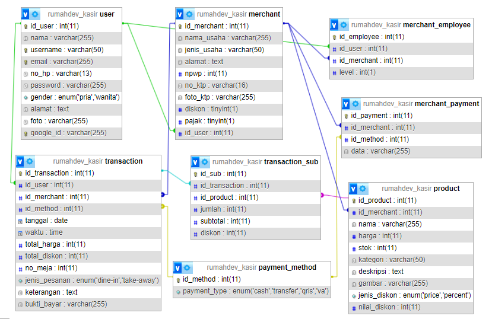

# Rumah Dev App Kasir
App Sistem Kasir (POS) diperuntukkan ke Cafe/Resto atau usaha sejenis yang lainnya.
Desain database:

## Informations
- Analysis Requirements System:
https://docs.google.com/spreadsheets/d/1ETTXgDjSgUPPLy17V7x7Izv0Kr4lqnUgnA_9F1sCmqQ/edit#gid=1429189567
- UI/UX References:
https://www.figma.com/file/VxRfW1OshdlRHQYvRGoDgQ/Ref-UI-Sistem-Kasir?type=design&node-id=0%3A1&mode=design&t=2fSe3RjbJs4ShVtt-1 

## How to Access
1. Make sure you have php/xampp installed
2. Clone repository to C:/xampp/htdocs
3. Open command, navigate to root project directory
4. Run `php spark serve`
5. Open http://localhost:8080/ in browser

